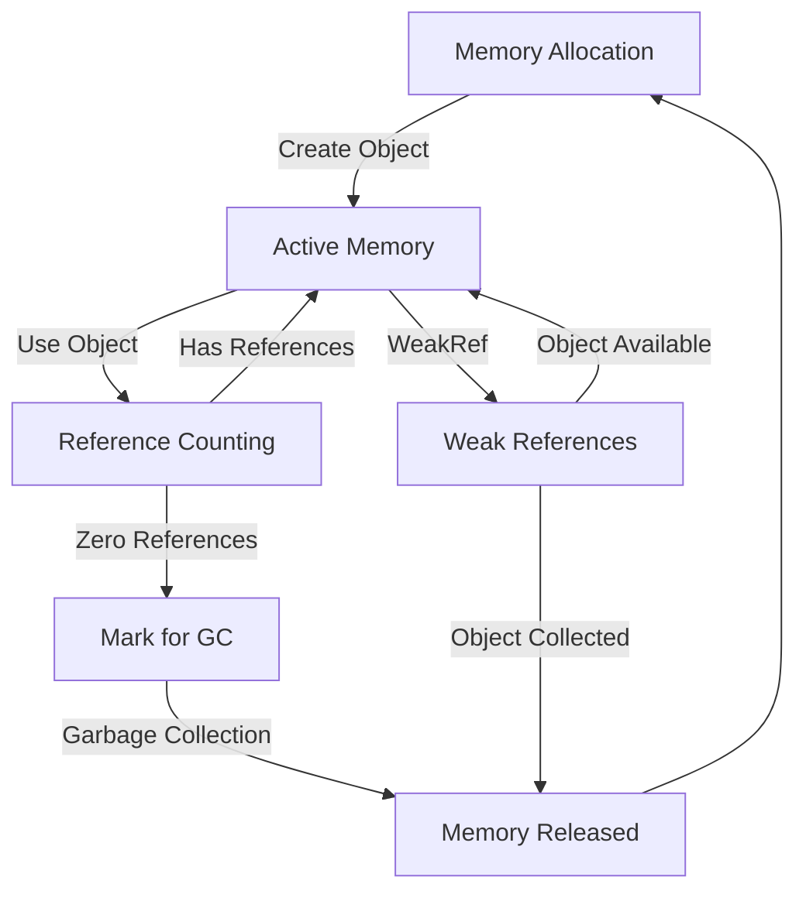
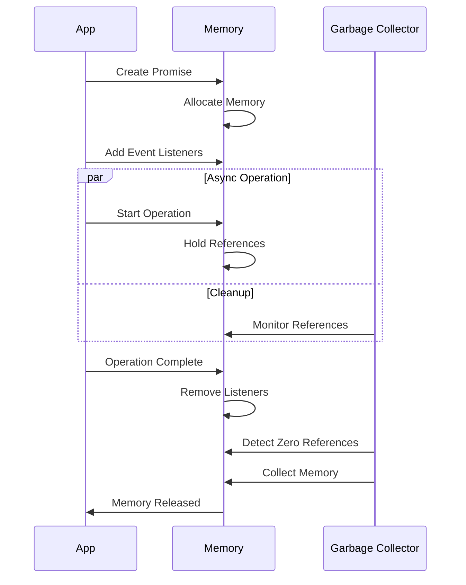

# Memory Management

## Overview

Memory management in async JavaScript involves strategies and patterns for efficiently allocating, using, and releasing memory resources in asynchronous operations. Proper memory management is crucial for maintaining application performance and preventing memory leaks, especially in long-running applications.

### Memory Management Flow



### Async Operation Memory Lifecycle



### Real-World Analogy

Think of memory management like:

1. **Office Space Management**

   - Your desk (memory heap) has limited space
   - Documents (objects) need to be organized and accessible
   - Completed tasks (unused objects) should be cleared away
   - Important references must be maintained
   - Regular cleanup (garbage collection) keeps the space usable

2. **Library Organization**

   - Books (objects) are stored in shelves (memory)
   - Card catalog (references) tracks book locations
   - Return system (garbage collection) handles unused books
   - Reserved books (active references) stay accessible
   - Storage optimization (memory compaction) maximizes space

3. **Restaurant Kitchen**

   - Ingredients (resources) need proper storage
   - Prep stations (memory allocation) have limited space
   - Used utensils (objects) need cleaning (recycling)
   - Recipe cards (references) track ingredient usage
   - Regular cleaning (garbage collection) maintains efficiency

4. **Warehouse Management**

   - Products (objects) occupy storage space
   - Inventory system (memory tracking) monitors usage
   - Shipping/receiving (allocation/deallocation) manages flow
   - Barcode system (references) tracks locations
   - Space optimization (defragmentation) improves efficiency

5. **Garden Maintenance**
   - Plants (objects) grow and need space
   - Garden beds (memory segments) have capacity limits
   - Pruning (garbage collection) removes dead growth
   - Plant markers (references) identify locations
   - Soil management (memory optimization) ensures health

### Common Use Cases

1. **Long-Running Operations**

   - Problem: Memory accumulation during extended async operations
   - Solution: Proper cleanup and reference management
   - Benefit: Stable memory usage over time

2. **Event Handler Management**

   - Problem: Forgotten event listeners causing memory leaks
   - Solution: Systematic event listener cleanup
   - Benefit: Prevented memory leaks and improved performance

3. **Cache Management**
   - Problem: Unbounded cache growth consuming memory
   - Solution: Implement size limits and eviction policies
   - Benefit: Controlled memory usage while maintaining performance

### How It Works

1. **Resource Tracking**

   - Monitor object allocations
   - Track reference counts
   - Identify memory patterns

2. **Cleanup Strategies**

   - Explicit cleanup calls
   - Reference nullification
   - Weak references usage

3. **Leak Prevention**

   - Closure management
   - Event listener cleanup
   - Timer cancellation

4. **Memory Optimization**
   - Object pooling
   - Data structure selection
   - Resource sharing

## Implementation

```typescript
// Base class for managing cleanable resources
class ResourceManager {
  private resources = new WeakMap<object, Set<() => void>>();

  register(owner: object, cleanup: () => void) {
    let cleanups = this.resources.get(owner);
    if (!cleanups) {
      cleanups = new Set();
      this.resources.set(owner, cleanups);
    }
    cleanups.add(cleanup);
  }

  cleanup(owner: object) {
    const cleanups = this.resources.get(owner);
    if (cleanups) {
      cleanups.forEach((cleanup) => cleanup());
      cleanups.clear();
      this.resources.delete(owner);
    }
  }
}

// Timer management example
class TimerManager {
  private timers = new Set<number>();

  setTimeout(callback: () => void, delay: number) {
    const id = window.setTimeout(() => {
      this.timers.delete(id);
      callback();
    }, delay);
    this.timers.add(id);
    return id;
  }

  clearAll() {
    this.timers.forEach((id) => window.clearTimeout(id));
    this.timers.clear();
  }
}

// Event listener management
class EventManager {
  private listeners = new Map<EventTarget, Map<string, Set<EventListener>>>();

  addEventListener(target: EventTarget, type: string, listener: EventListener) {
    let targetListeners = this.listeners.get(target);
    if (!targetListeners) {
      targetListeners = new Map();
      this.listeners.set(target, targetListeners);
    }

    let typeListeners = targetListeners.get(type);
    if (!typeListeners) {
      typeListeners = new Set();
      targetListeners.set(type, typeListeners);
    }

    typeListeners.add(listener);
    target.addEventListener(type, listener);
  }

  removeAllListeners() {
    this.listeners.forEach((targetListeners, target) => {
      targetListeners.forEach((listeners, type) => {
        listeners.forEach((listener) => {
          target.removeEventListener(type, listener);
        });
      });
    });
    this.listeners.clear();
  }
}

// Cache with memory limits
class MemoryLimitedCache<K, V> {
  private cache = new Map<K, V>();
  private maxEntries: number;

  constructor(maxEntries: number) {
    this.maxEntries = maxEntries;
  }

  set(key: K, value: V) {
    if (this.cache.size >= this.maxEntries) {
      const firstKey = this.cache.keys().next().value;
      this.cache.delete(firstKey);
    }
    this.cache.set(key, value);
  }

  get(key: K): V | undefined {
    return this.cache.get(key);
  }

  clear() {
    this.cache.clear();
  }
}
```

## Common Memory Leaks

### 1. Event Listeners

```typescript
class Component {
  private eventManager = new EventManager();

  initialize() {
    this.eventManager.addEventListener(
      window,
      'resize',
      this.handleResize.bind(this)
    );
  }

  cleanup() {
    this.eventManager.removeAllListeners();
  }

  private handleResize() {
    // Handle resize event
  }
}
```

### 2. Timer References

```typescript
class AsyncOperation {
  private timerManager = new TimerManager();

  start() {
    this.timerManager.setTimeout(() => {
      // Perform operation
    }, 1000);
  }

  cleanup() {
    this.timerManager.clearAll();
  }
}
```

### 3. Closure References

```typescript
class DataProcessor {
  private cache = new MemoryLimitedCache<string, object>(100);

  process(data: object) {
    const key = JSON.stringify(data);
    let result = this.cache.get(key);

    if (!result) {
      result = this.computeResult(data);
      this.cache.set(key, result);
    }

    return result;
  }

  private computeResult(data: object): object {
    // Compute result
    return {};
  }

  cleanup() {
    this.cache.clear();
  }
}
```
