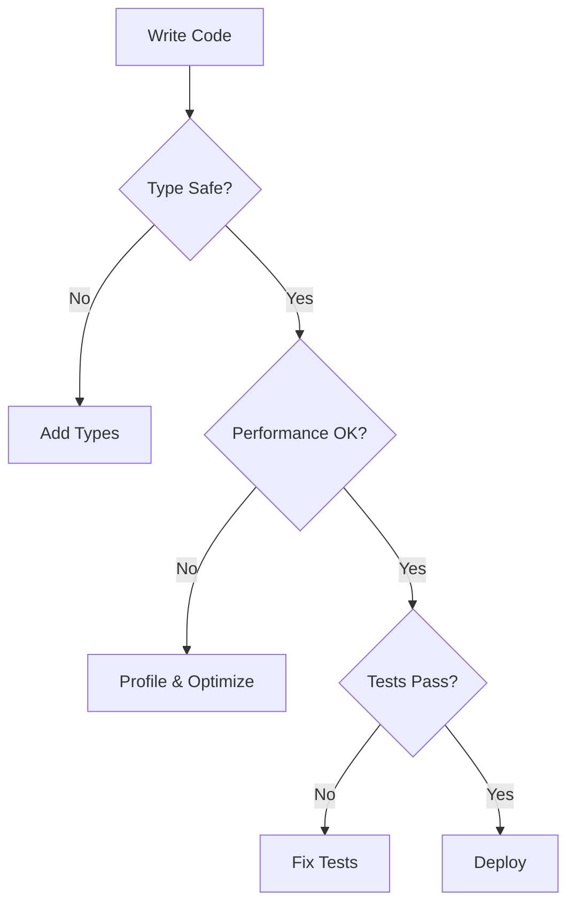
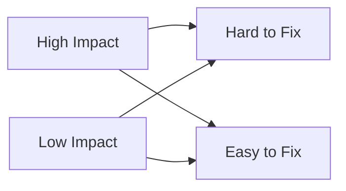

# Common Gotchas and Best Practices

This guide covers common programming pitfalls and anti-patterns that developers often encounter, along with best practices to avoid them. Each section is explained in a beginner-friendly way with clear examples of what not to do and how to do it right.

[[toc]]

::: tip Quick Navigation
Use the table of contents above to jump to specific sections, or expand/collapse categories below to focus on specific topics.
:::

## Core JavaScript & TypeScript

### Type System & Language Features

::: details Type System Details

#### Magic Strings and Numbers

##### The Problem

Using hardcoded strings and numbers throughout your code makes it difficult to maintain and prone to typos.

```typescript
// ❌ Bad: Magic strings and numbers
function calculateDiscount(price) {
  if (status === 'premium') {
    // Magic string
    return price * 0.2; // Magic number (20% discount)
  }
  return price * 0.1; // Magic number (10% discount)
}

// ✅ Good: Use constants with meaningful names
const CUSTOMER_TYPES = {
  PREMIUM: 'premium',
  REGULAR: 'regular',
} as const;

const DISCOUNT_RATES = {
  [CUSTOMER_TYPES.PREMIUM]: 0.2,
  [CUSTOMER_TYPES.REGULAR]: 0.1,
} as const;

function calculateDiscount(price: number, status: keyof typeof CUSTOMER_TYPES) {
  return price * DISCOUNT_RATES[status];
}
```

#### Type Coercion Confusion

##### The Problem

JavaScript's automatic type coercion can lead to unexpected results.

```typescript
// ❌ Bad: Relying on type coercion
if (userId == '123') {
} // Loose equality
if (someValue == null) {
} // Ambiguous null check

// ✅ Good: Use strict equality and explicit type checks
if (userId === '123') {
} // Strict equality
if (someValue === null || someValue === undefined) {
} // Explicit null/undefined check
```

#### Additional Type System Gotchas

```typescript
// ❌ Bad: Unsafe type assertions
const value = someValue as any as SpecificType;

// ✅ Good: Type guards and runtime checks
function isSpecificType(value: unknown): value is SpecificType {
  return value !== null && typeof value === 'object' && 'requiredProp' in value;
}
```

#### Generic Constraints

```typescript
// ❌ Bad: Loose generic constraints
function process<T>(value: T) {
  value.someMethod();  // Error: method might not exist

// ✅ Good: Proper constraints
function process<T extends { someMethod: () => void }>(value: T) {
  value.someMethod();  // Safe
}
```

:::

### Functions & Methods

::: details Function Details

#### Function Parameter Mutation

##### The Problem

Modifying function parameters can lead to unexpected side effects and make code harder to debug.

```typescript
// ❌ Bad: Mutating function parameters
function processUser(user) {
  user.lastLogin = new Date(); // Mutates the original object
  return user;
}

// ✅ Good: Create new objects instead of mutating
function processUser(user) {
  return {
    ...user,
    lastLogin: new Date(),
  };
}
```

#### Additional Function Gotchas

```typescript
// ❌ Bad: Mutable default parameters
function createUser(config = {}) {
  config.timestamp = Date.now(); // Mutates the default object
}

// ✅ Good: Immutable defaults
function createUser(config = {}) {
  return {
    ...config,
    timestamp: Date.now(),
  };
}
```

#### Method Binding

```typescript
// ❌ Bad: Lost context
class Handler {
  handle() {
    /* ... */
  }
  setup() {
    element.addEventListener('click', this.handle); // 'this' will be wrong
  }
}

// ✅ Good: Proper binding
class Handler {
  handle = () => {
    /* ... */
  }; // Arrow function preserves context
  setup() {
    element.addEventListener('click', this.handle);
  }
}
```

:::

## Testing & Quality Assurance

### Test Organization

::: details Testing Details

#### Testing Anti-Patterns

##### The Problem

Common testing mistakes that lead to unreliable or hard-to-maintain tests.

```typescript
// ❌ Bad: Brittle selectors in tests
test('submits form', async () => {
  await page.click('button.submit-btn.primary'); // Fragile CSS selector
});

// ✅ Good: Resilient selectors
test('submits form', async () => {
  await page.getByRole('button', { name: 'Submit' }); // Resilient to styling changes
});

// ❌ Bad: Time-based tests
test('debounce works', async () => {
  await someAction();
  await new Promise((resolve) => setTimeout(resolve, 1000)); // Arbitrary delay
  expect(result).toBe(expected);
});

// ✅ Good: Event-based tests
test('debounce works', async () => {
  await someAction();
  await waitForCondition(() => result === expected); // Wait for actual condition
});
```

#### Additional Testing Gotchas

```typescript
// ❌ Bad: Tests affecting each other
let globalTestData = [];

beforeEach(() => {
  globalTestData.push('test');
});

// ✅ Good: Isolated test data
const createTestData = () => ['test'];

beforeEach(() => {
  const testData = createTestData();
});
```

#### Snapshot Testing Abuse

```typescript
// ❌ Bad: Large, brittle snapshots
it('renders component', () => {
  expect(render(<ComplexComponent />)).toMatchSnapshot();
});

// ✅ Good: Focused, meaningful snapshots
it('renders specific elements', () => {
  const { getByRole } = render(<ComplexComponent />);
  expect(getByRole('button')).toMatchSnapshot();
});
```

:::

## Package Management & Dependencies

### Dependency Management

::: details Dependency Details

#### Package Version Conflicts

##### The Problem

Inconsistent or conflicting package versions can cause subtle bugs and compatibility issues.

```typescript
// ❌ Bad: Loose version constraints
{
  "dependencies": {
    "lodash": "^4.0.0",  // Could get incompatible updates
    "react": "*"  // Any version is dangerous
  }
}

// ✅ Good: Explicit version constraints
{
  "dependencies": {
    "lodash": "4.17.21",  // Exact version
    "react": "~18.2.0"  // Patch updates only
  }
}
```

#### Additional Package Management Gotchas

```typescript
// ❌ Bad: Ignoring peer dependencies
{
  "dependencies": {
    "react": "18.0.0",
    "some-plugin": "^1.0.0"  // Requires React 17
  }
}

// ✅ Good: Explicit peer dependencies
{
  "dependencies": {
    "react": "17.0.2",
    "some-plugin": "^1.0.0"
  },
  "peerDependencies": {
    "react": "^17.0.0"
  }
}
```

#### Development Dependencies

```typescript
// ❌ Bad: Development tools in dependencies
{
  "dependencies": {
    "jest": "^29.0.0",
    "typescript": "^5.0.0"
  }
}

// ✅ Good: Proper dependency categorization
{
  "devDependencies": {
    "jest": "^29.0.0",
    "typescript": "^5.0.0"
  }
}
```

:::

## Styling & CSS

### CSS Best Practices

::: details CSS Details

#### CSS Specificity Wars

##### The Problem

Escalating CSS specificity makes styles hard to maintain and override.

```typescript
// ❌ Bad: Specificity escalation
.header .nav .list .item .link {  // Too specific
  color: blue;
}
#main-content div.container .button {  // Mixed specificity
  background: red;
}

// ✅ Good: Flat specificity with BEM
.nav__item {  // Single class, clear hierarchy
  color: blue;
}
.button--primary {  // Modifier pattern
  background: red;
}
```

#### CSS-in-JS Performance

##### The Problem

Inefficient CSS-in-JS implementations can cause performance issues.

```typescript
// ❌ Bad: Dynamic styles in render
function Component() {
  return (
    <div
      style={{  // New object created every render
        color: 'blue',
        padding: '20px'
      }}
    >
      Content
    </div>
  );
}

// ✅ Good: Memoized styles
const styles = {  // Object created once
  container: {
    color: 'blue',
    padding: '20px'
  }
};

function Component() {
  return (
    <div style={styles.container}>
      Content
    </div>
  );
}
```

:::

## Performance & Optimization

### Performance Patterns

::: details Performance Details

#### Memory Leaks

##### The Problem

Not cleaning up resources can lead to memory leaks and performance issues.

```typescript
// ❌ Bad: Resources not cleaned up
class VideoPlayer {
  constructor() {
    this.video = document.createElement('video');
    this.stream = navigator.mediaDevices.getUserMedia({ video: true });
  }
}

// ✅ Good: Proper resource cleanup
class VideoPlayer {
  constructor() {
    this.video = document.createElement('video');
    this.stream = null;
  }

  async start() {
    this.stream = await navigator.mediaDevices.getUserMedia({ video: true });
    this.video.srcObject = this.stream;
  }

  stop() {
    if (this.stream) {
      this.stream.getTracks().forEach((track) => track.stop());
      this.stream = null;
    }
    this.video.srcObject = null;
  }
}
```

#### Event Handler Optimization

```typescript
// ❌ Bad: New function every render
function Component() {
  return (
    <button onClick={() => handleClick()}>
      Click me
    </button>
  );
}

// ✅ Good: Memoized handler
function Component() {
  const handleClick = useCallback(() => {
    // Handle click
  }, []);

  return <button onClick={handleClick}>Click me</button>;
}
```

:::

## Security & Error Handling

### Security Best Practices

::: details Security Details

#### Security Vulnerabilities

##### The Problem

Common security oversights can expose your application to attacks.

```typescript
// ❌ Bad: Security vulnerabilities
const userInput = '<script>alert("XSS")</script>';
element.innerHTML = userInput; // XSS vulnerability

// ✅ Good: Sanitize input and use safe alternatives
import DOMPurify from 'dompurify';
element.textContent = userInput; // Safe from XSS
// Or if HTML is needed:
element.innerHTML = DOMPurify.sanitize(userInput);
```

#### Error Boundaries

##### The Problem

Not implementing proper error boundaries can crash entire applications.

```typescript
// ❌ Bad: No error boundaries
function App() {
  return (
    <div>
      <ComponentThatMightCrash />
    </div>
  );
}

// ✅ Good: Implement error boundaries
class ErrorBoundary extends React.Component {
  state = { hasError: false };

  static getDerivedStateFromError(error) {
    return { hasError: true };
  }

  render() {
    if (this.state.hasError) {
      return <ErrorFallback />;
    }
    return this.props.children;
  }
}

function App() {
  return (
    <ErrorBoundary>
      <ComponentThatMightCrash />
    </ErrorBoundary>
  );
}
```

:::

## State Management & Data Flow

### State Management Patterns

::: details State Management Details

#### Global State Anti-patterns

##### The Problem

Improper state management can lead to unpredictable behavior and maintenance nightmares.

```typescript
// ❌ Bad: Global state mutations
window.globalState = {
  user: null,
  settings: {},
};

// ✅ Good: Centralized state management
import { createStore } from '@reduxjs/toolkit';

const store = createStore({
  reducer: {
    user: userReducer,
    settings: settingsReducer,
  },
});
```

#### Prop Drilling

##### The Problem

Passing props through multiple levels of components makes code hard to maintain.

```typescript
// ❌ Bad: Prop drilling through multiple levels
function GrandParent({ user }) {
  return <Parent user={user} />;
}
function Parent({ user }) {
  return <Child user={user} />;
}
function Child({ user }) {
  return <div>{user.name}</div>;
}

// ✅ Good: Context or state management
const UserContext = React.createContext();

function GrandParent() {
  return (
    <UserContext.Provider value={user}>
      <Parent />
    </UserContext.Provider>
  );
}
function Child() {
  const user = useContext(UserContext);
  return <div>{user.name}</div>;
}
```

:::

## Async Programming & Concurrency

### Async Patterns

::: details Async Details

#### Race Conditions

##### The Problem

Async operations can lead to race conditions when not properly handled.

```typescript
// ❌ Bad: Race condition in async operations
async function fetchUserData(userId) {
  const response = await fetch(`/api/users/${userId}`);
  currentUser = await response.json(); // Global state mutation
}

// ✅ Good: Race condition prevention
let currentRequest = null;
async function fetchUserData(userId) {
  const request = fetch(`/api/users/${userId}`);
  currentRequest = request; // Track current request

  const response = await request;
  if (currentRequest === request) {
    // Only update if this is still the current request
    return await response.json();
  }
}
```

#### Promise Chain Management

##### The Problem

Complex promise chains can become hard to maintain and debug.

```typescript
// ❌ Bad: Nested promise chains
fetchUser().then((user) => {
  return fetchPosts(user.id).then((posts) => {
    return fetchComments(posts[0].id).then((comments) => {
      // Deep nesting
    });
  });
});

// ✅ Good: Async/await with proper error handling
async function fetchUserData() {
  try {
    const user = await fetchUser();
    const posts = await fetchPosts(user.id);
    const comments = await fetchComments(posts[0].id);
    return { user, posts, comments };
  } catch (error) {
    handleError(error);
  }
}
```

:::

## Code Organization & Architecture

### Architecture Patterns

::: details Architecture Details

#### Component Organization

##### The Problem

Poor component organization leads to maintenance difficulties and code duplication.

```typescript
// ❌ Bad: Mixed concerns in components
function UserProfile() {
  const [user, setUser] = useState(null);
  const [loading, setLoading] = useState(true);

  useEffect(() => {
    fetchUser().then(data => {
      setUser(data);
      setLoading(false);
    });
  }, []);

  return (
    <div>
      {loading ? <Spinner /> : <UserData user={user} />}
    </div>
  );
}

// ✅ Good: Separated concerns
function useUser(userId) {
  const [user, setUser] = useState(null);
  const [loading, setLoading] = useState(true);

  useEffect(() => {
    fetchUser(userId).then(data => {
      setUser(data);
      setLoading(false);
    });
  }, [userId]);

  return { user, loading };
}

function UserProfile({ userId }) {
  const { user, loading } = useUser(userId);

  if (loading) return <Spinner />;
  return <UserData user={user} />;
}
```

#### File Structure

##### The Problem

Inconsistent file organization makes it hard to locate and maintain code.

```typescript
// ❌ Bad: Mixed file organization
/src
  /components
    UserProfile.tsx
    userProfile.css
    userProfileTypes.ts
    userProfileUtils.ts

// ✅ Good: Feature-based organization
/src
  /features
    /user-profile
      /components
        UserProfile.tsx
      /hooks
        useUser.ts
      /types
        types.ts
      /utils
        formatters.ts
      index.ts
```

:::

## Development Workflow

### Best Practices

::: details Workflow Details

#### Version Control

##### The Problem

Poor version control practices can lead to confusion and lost work.

```typescript
// ❌ Bad: Large, mixed commits
// Single commit with multiple unrelated changes
git commit -m "Updated user profile, fixed bug in cart, added new feature"

// ✅ Good: Atomic commits with clear messages
git commit -m "feat(user): add profile image upload"
git commit -m "fix(cart): handle empty cart state"
git commit -m "feat(auth): implement password reset"
```

#### Code Review Process

##### The Problem

Ineffective code review practices can let bugs slip through.

```typescript
// ❌ Bad: Large, monolithic PRs
// PR with 50+ files changed, multiple features

// ✅ Good: Focused, single-purpose PRs
// PR for single feature with clear scope
```

:::

## Visual Learning Aids

### Common Gotchas Flow Chart



### Anti-Pattern Impact Matrix



## Interactive Learning

::: details Try It Yourself

### Exercise 1: Find the Gotcha

```typescript
// What's wrong with this code?
function processData(data) {
  if (data == null) return;
  if (data.length == 0) return;
  for (var i = 0; i < data.length; i++) {
    setTimeout(() => {
      console.log(data[i]);
    }, 100);
  }
}
```

### Exercise 2: Fix the Pattern

```typescript
// How would you improve this?
class DataManager {
  static instance;
  data = [];

  static getInstance() {
    if (!DataManager.instance) {
      DataManager.instance = new DataManager();
    }
    return DataManager.instance;
  }
}
```

:::

## Best Practices Summary

::: tip Quick Reference
Keep these principles in mind while coding:

1. Use constants for magic strings and numbers
2. Prefer strict equality (`===`) over loose equality (`==`)
3. Avoid mutating function parameters
4. Minimize global state usage
5. Use async/await instead of nested callbacks
6. Always clean up resources and event listeners
7. Implement proper error handling
8. Optimize code only after measuring performance
9. Write descriptive error messages
10. Follow consistent naming conventions
11. Use early returns to avoid deep nesting
12. Handle dates consistently with proper timezone awareness
13. Implement security best practices
14. Centralize state management
15. Use established libraries for complex functionality
16. Implement proper error boundaries
17. Be consistent with async patterns
18. Batch DOM updates for better performance
19. Always clean up resources
20. Leverage TypeScript features effectively
    :::

## Additional Resources

::: details External Learning Resources

- [TypeScript Documentation](https://www.typescriptlang.org/docs/)
- [JavaScript MDN Web Docs](https://developer.mozilla.org/en-US/docs/Web/JavaScript)
- [React Best Practices](https://reactjs.org/docs/hooks-rules.html)
- [Web Security by OWASP](https://owasp.org/www-project-top-ten/)
- [TypeScript Deep Dive](https://basarat.gitbook.io/typescript/)
- [Clean Code JavaScript](https://github.com/ryanmcdermott/clean-code-javascript)
- [React Patterns](https://reactpatterns.com/)
  :::

## Contributing

::: info Help Improve This Guide
Found a mistake or want to contribute? Check our [contribution guidelines](../CONTRIBUTING.md).
:::
