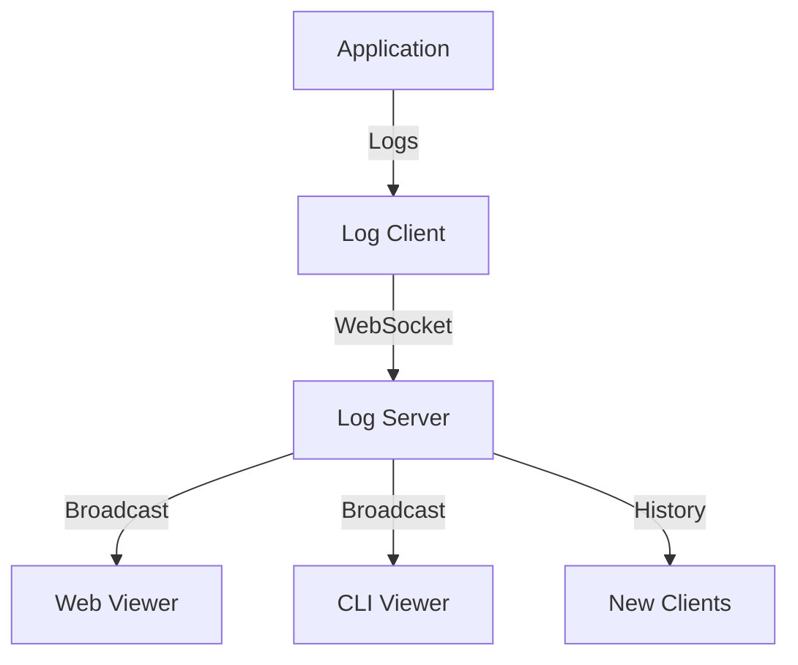

# Logger Service Documentation

## Overview

The Logger Service is a comprehensive logging solution designed for modern web applications. It provides real-time log streaming, categorized log sections, filterable log levels, and both CLI and web-based interfaces.

## Architecture

### Components

1. **Log Server** (`standalone-log-server.ts`)
   - WebSocket server that receives and broadcasts logs
   - Maintains log history
   - Handles client connections and disconnections
   - Port: 3333 (configurable via LOG_SERVER_PORT)

2. **Log Client** (`standalone-log-client.ts`)
   - Connects to log server via WebSocket
   - Buffers messages during disconnections
   - Implements automatic reconnection with exponential backoff
   - Provides type-safe logging API

3. **Web Viewer** (`web-log-viewer.ts`)
   - Browser-based log viewer
   - Real-time log streaming
   - Filterable by category and log level
   - Categorized log sections
   - Port: 3334 (configurable via LOG_WEB_PORT)

4. **CLI Viewer** (`cli-log-viewer.ts`)
   - Terminal-based log viewer
   - Color-coded output
   - Interactive filtering
   - Command-based interface

### Data Flow



### Log Categories
- system
- performance
- tooltip
- markdown
- dev
- build

### Log Levels
- debug
- info
- warn
- error

## Integration Guide

### 1. As a Local Service

#### Installation
```bash
# Clone the logger service
git clone https://github.com/your-org/logger-service.git

# Install dependencies
pnpm install
```

#### Usage
```typescript
import { logger } from './logger';

// Basic logging
logger.debug('category', 'Debug message');
logger.info('category', 'Info message');
logger.warn('category', 'Warning message');
logger.error('category', 'Error message', { error: new Error('Details') });

// With data
logger.info('performance', 'Operation completed', {
  duration: 123,
  operation: 'task'
});
```

### 2. As an NPM Package

#### Installation
```bash
pnpm add @your-org/logger-service
```

#### Configuration
```typescript
// logger.config.ts
import { configureLogger } from '@your-org/logger-service';

configureLogger({
  serverUrl: 'ws://localhost:3333',
  bufferSize: 1000,
  reconnectInterval: 5000,
  maxRetries: 10
});
```

#### Usage
```typescript
import { logger } from '@your-org/logger-service';

logger.info('category', 'Message');
```

## Available Scripts

### Development
```bash
# Start everything (recommended)
pnpm run dev

# Start components individually
pnpm run logs:server  # Start log server only
pnpm run logs:viewer  # Start web viewer only
pnpm run logs:cli     # Start CLI viewer only
```

### Production
```bash
# Build the package
pnpm run build

# Start in production mode
NODE_ENV=production pnpm run start
```

## Web Viewer Interface

The web viewer provides a modern, intuitive interface for viewing logs:

### Features
- Real-time log streaming
- Category-based filtering
- Log level filtering
- Searchable logs
- Clear individual sections
- Auto-scroll option
- Dark/light theme support

### Sections
1. **Build Progress** (📦)
   - Build system logs
   - Compilation status
   - Asset generation

2. **Tooltip Processing** (🔍)
   - Tooltip generation
   - Processing status
   - Error handling

3. **Performance Metrics** (⚡)
   - Timing information
   - Resource usage
   - Operation durations

4. **Errors** (❌)
   - Error messages
   - Stack traces
   - Error context

5. **Debug Output** (🔧)
   - Development logs
   - Diagnostic information
   - System status

## CLI Viewer Commands

| Command | Description |
|---------|-------------|
| h, help | Show help menu |
| c, clear | Clear screen |
| f, filter | Toggle filters |
| o, open | Open web viewer |
| q, quit | Exit viewer |

## Environment Variables

| Variable | Default | Description |
|----------|---------|-------------|
| LOG_SERVER_PORT | 3333 | Log server WebSocket port |
| LOG_WEB_PORT | 3334 | Web viewer HTTP port |
| NODE_ENV | development | Environment mode |
| LOG_LEVEL | info | Minimum log level |
| LOG_CATEGORIES | * | Enabled categories |

## Best Practices

1. **Categorization**
   - Use consistent categories
   - Keep category names short
   - Use hierarchical categories for complex apps

2. **Log Levels**
   - debug: Detailed information for debugging
   - info: General operational information
   - warn: Warning messages for potential issues
   - error: Error messages for actual problems

3. **Performance**
   - Use structured logging
   - Avoid logging sensitive information
   - Clean up old logs periodically
   - Monitor buffer size in disconnected state

4. **Security**
   - Never log credentials
   - Sanitize error messages
   - Use secure WebSocket connections in production
   - Implement proper access control

## Troubleshooting

### Common Issues

1. **Connection Failures**
   ```bash
   # Check if ports are available
   lsof -i :3333
   lsof -i :3334
   
   # Clear ports if needed
   kill $(lsof -t -i:3333)
   ```

2. **Missing Logs**
   - Verify log level configuration
   - Check enabled categories
   - Ensure client is connected
   - Check buffer status

3. **Performance Issues**
   - Reduce log verbosity
   - Increase buffer size
   - Implement log rotation
   - Use appropriate log levels

## Contributing

### Development Setup
```bash
# Clone repository
git clone https://github.com/your-org/logger-service.git

# Install dependencies
pnpm install

# Run tests
pnpm test

# Start development environment
pnpm run dev
```

### Pull Request Guidelines
1. Follow the existing code style
2. Add/update tests as needed
3. Update documentation
4. Ensure all tests pass
5. Add changelog entry

## License

MIT License - see [LICENSE.md](LICENSE.md) for details 